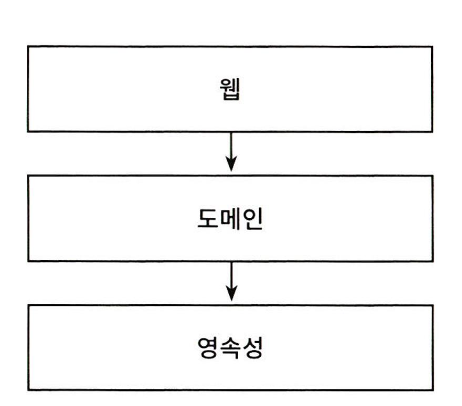
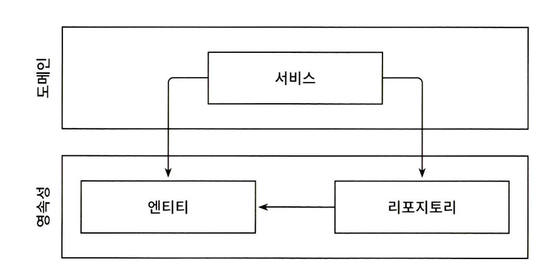
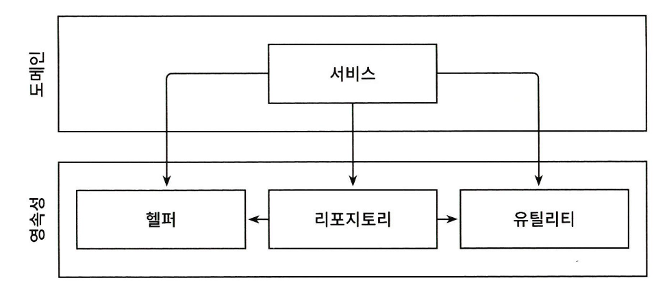
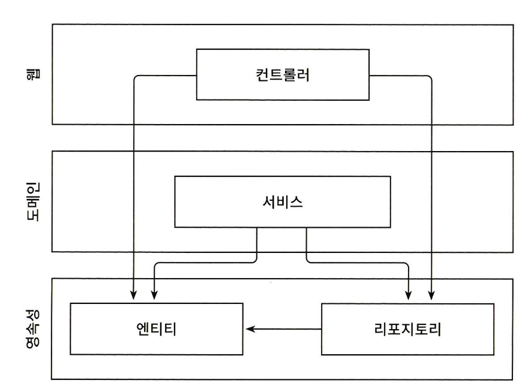

# 계층형 아키텍처의 문제는 무엇일까?

## 목차

1. [계층형 아키텍처](#계층형-아키텍처)
2. [계층형 아키텍처 문제점](#계층형-아키텍처-패턴의-문제점)

# 계층형 아키텍처

    

- 웹 계층 : 요청을 받아 도메인 혹은 비즈니스 계층에 있는 서비스로 요청을 보낸다
- 서비스 계층 : 필요한 비즈니스 로직 수행, 도메인 엔티티의 조회,변경을 위해 영속성 계층의 컴포넌트를 호출

### 계층형 아키텍처 패턴의 장점

- 견고한 아키텍처 패턴으로 계층을 잘 이해하고 구성한다면 도메인 로직 변경없이 웹 게층과 영속성 계층의 사용된 기술을 변경가능하다
- 기존 기능에 영향을 주지 않고 새로운 기능을 추가할 수 있다

# 계층형 아키텍처 패턴의 문제점

## 1. 계층형 아키텍처는 데이터베이스 주도 설계를 유도한다

정의에 따르면 전통적인 게층형 아키텍처의 토대는 데이터베이스(영속성 계층)이다

- 웹계층은 도메인 계층에 의존 → 도메인 계층은 영속성 계층에 의존하기 때문에 자연스럽게 데이터베이스에 의존하게 된다
- 즉 모든 것이 영속성 계층을 토대로 만들어진다

### 왜 데이터베이스 중심의 아키텍처가 만들어질까?

> 가장 큰 원인은 ORM 프레임워크를 사용하기 때문이다

    

- 일반적으로 ORM에 의해 관리되는 엔티티들은 영속성 계층에 두며 계층은 아래 방향으로만 접근 가능하기 때문에 도메인 계층에서 접근할 수 있다

→하지만 이렇게 되면 영속성 계층과 도메인 계층 사이 강한 결합이 생긴다는 문제다 (서비스는 영속성 모델을 비즈니스 모델처럼 사용하게 되고 도메인 로직뿐만 아니라 즉시로딩, 지연로딩, 데이터베이스 트랜잭션, 캐시 플러시 등 영속성 계층과 관련된 작업들을 해야한다)

→강한 결합으로 인해 영속성 코드와 도메인 코드 둘 중 하나만 바꾸는 것이 어려워진다는 점이다

## 2. 지름길을 택하기 쉬워진다

> 계층형 아키텍처의 유일한 규칙은 특정 게층에서 같은 계층에 있는 컴포넌트나 아래에 있는 계층에만 접근 가능하다는 점

    

- 만약 상위 계층에 접근해야한다면 간단하게 컴포넌트 계층을 아래로 내리면 끝이다
- 이 과정이 반복될수록 **영속성 계층은 비대해진다**는 문제가 있다 (헬퍼나 유틸리티 컴포넌트들이 그림처럼 아래 계층으로 내릴 가능성이 큰 후보다)

## 3. 테스트하기 어려워진다

    

- 1번째 이유 : 단 하나의 필드를 조작한다고 할때 도메인 로직을 웹 게층에 구현하게 된다는 것이다 만약 유스케이스가 확장된다면 더 많은 도메인 로직이 웹 계층에 추가해서 전반적으로 책임이 섞이고 핵심 도메인 로직들이 퍼져나갈 확률이 높아진다
- 2번째 이유 : 웹 계층 테스트에서 도메인 게층 뿐만 아니라 영속성 계층까지 테스트를 진행할때 영속성 계층도 모킹해야 한다는 점이다 → 테스트의 복잡도가 올라가고 설정이 복잡해져 테스트를 진행하지 않는 첫걸음이 되는 문제가 발생한다

## 4. 유스케이스를 숨긴다

> 기능을 추가하거나 변경할 적절한 위치를 찾는 일이 빈번하기 때문에 아키텍처는 코드를 빠르게 탐색하는 데 도움이 돼야 한다

### 4-1. 계층형 아키텍처는 도메인 로직이 여러 계층에 걸쳐 흩어지기 쉽다

> 유스케이스가 간단해서 도메인 계층을 생략한다면 웹 계층에 존재할 수도 있고, 도메인 계층과 영속성 게층 모두에서 접근할 수 있도록 특정 컴포넌트를 아래로 내렸다면 영속성 계층에 존재할 수도 있다.

→ 이럴 경우 새로운 기능을 추가할 적당한 위치를 찾는일이 어려워진다

### 4-2. 서비스의 너비

> 계층형 아키텍처는 도메인 서비스의 너비에 대한 규칙이 없다

넓은 서비스는 영속성 계층에 많은 의존성을 갖게 되고 다시 웹 레이어의 많은 컴포넌트가 이 서비스에 의존하게 된다

→ 서비스 테스트가 어려워지고 작업해야 할 유스케이스를 책임지는 서비스를 찾기도 어려워진다

## 5. 동시 작업이 어려워진다

> 지연되는 소프트웨어 프로젝트에 인력을 더하는 것은 개발을 늦출 뿐이다. -프레더릭 P.브룩스

### 프로젝트에 인원이 더 투입될 경우 작업 속도가 더 빨라질까?

- 아키텍처가 동시 작업을 지원해야 하지만 계층형 아키텍처에서는 쉽지 않다
- 데이터베이스 주도 설계는 영속성 로직이 도메인 로직과 너무 뒤섞여서 각 측면을 개별적으로 작업할 수 없기 때문이다
