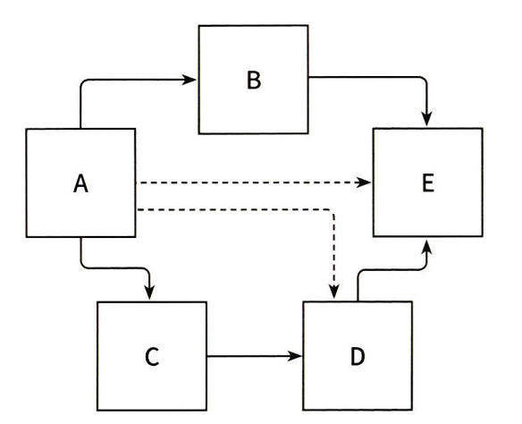
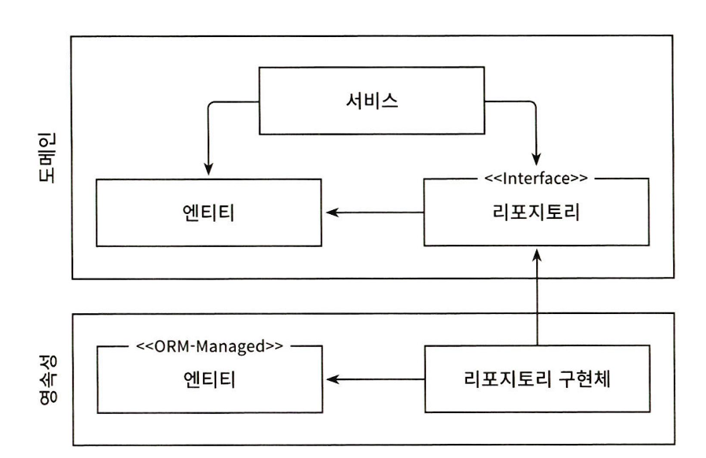
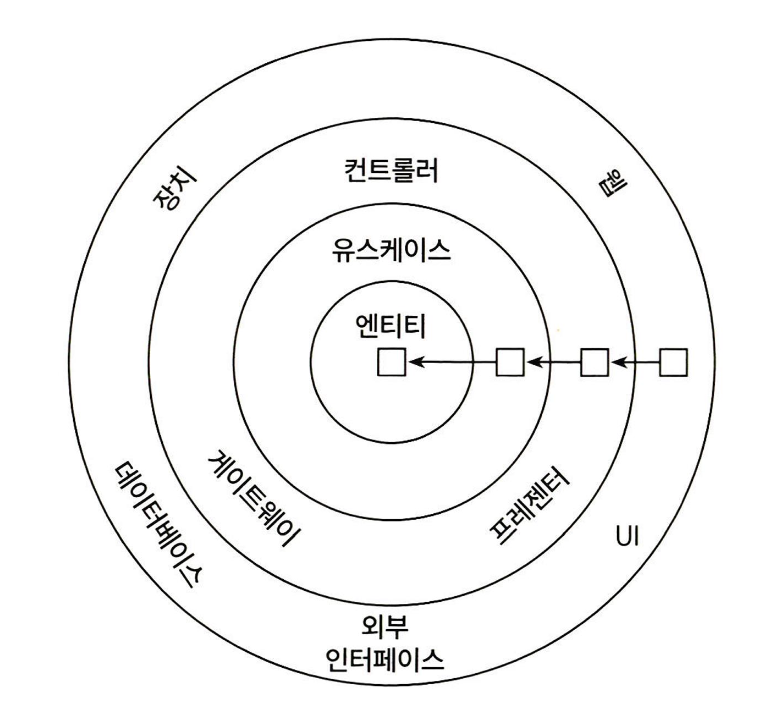
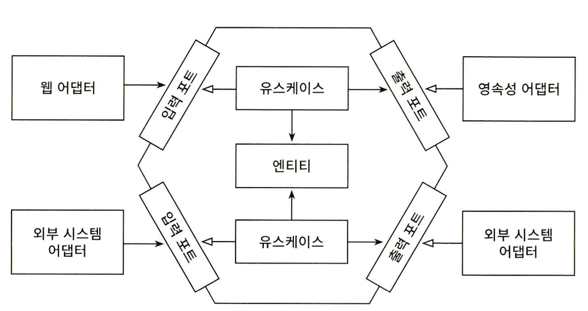

## 2장에서는 계층형 아키텍처의 대안에 대해 진행한다

먼저 객체 지향의 5대원칙중 단일 책임 원칙과 의존성 역전 원칙에 대해 알아보자

# 단일 책임 원칙

일반적인 해석

> **SRP(Single Responsibility Principle)
> 하나의 컴포넌트는 오로지 한 가지 일만 해야하고, 그것을 올바르게 수행해야 한다**

오로지 한가지 일만 하는 것 은 가장 직관적으로 해석한 것이므로 오해의 여지가 있다

단일 책임 원칙은 다음과 같다

> 컴포넌트를 변경하는 이유는 오직 하나뿐이어야 한다

책임은 사실 오로지 한가지 일만 하는 것 보다는 변경할 이유로 해석 해야한다

아키텍처 관점에서 보자

- 만약 컴포넌트를 변경할 이유가 한 가지라면 우리는 어떤 다른 이유로 소프트웨어를 변경하더라도 이 컴포넌트에 대해서는 전혀 신경 쓸 필요가 없다 즉 우리가 기대한 대로 동작할 것이기 때문이다
- 하지만 변경할 이유라는 것은 컴포넌트 간의 의존성을 통해 너무도 쉽게 전파된다

    

위와 같은 상황에서 보자

A는 현재 모든 컴포넌트와 의존되어 있다

만약 새로운 요구사항에 대해서 E의 기능을 수정한다면 A의 경우에도 수정하는 작업이 필요할 것이다

많은 코드는 단일 책임 원칙을 위반하기 때문에 시간이 갈수록 변경하기 더 어려워지고 그로 인해 변경 비용도 증가한다

# 의존성 역전 원칙

> DIP(Dependency Inversion Principle)
> 코드 상의 어떤 의존성이든 그 방향을 바꿀 수(역전시킬 수) 있다

계층형 아키텍처에서 계층 간 의존성은 항상 다음 계층인 아래 방향을 가리킨다

따라서 영속성 게층에 대한 도메인 계층의 의존성 때문에 영속성 계층을 변경할 때마다 도메인 계층도 수정해야한다 그러나 **도메인 계층은 애플리케이션에서 가장 중요한 코드다**

영속성 계층의 코드가 변경되더라도 도메인 계층의 코드가 변경되지 않게 **의존성 역전이 필요한 것이다**

어떻게 의존성 역전이 가능할까?

- 양쪽 코드를 모두 제어할 수 있을 때만 의존성 역전이 가능하다

    

1.  엔티티는 도메인 객체를 표현하고 도메인 코드는 이 엔티티들의 상태를 변경하는 일을 중심으로 하기 떄문에 먼저 엔티티를 도메인 계층으로 올린다
2.  그럴경우 영속성 계층의 리포지토리가 도메인 계층의 엔티티에 의존하기 때문에 **순환 의존성 문제가 생긴다**
3.  따라서 의존성 역전 원칙(DIP)를 적용하여 도메인 계층에는 리포지토리의 인터페이스를 만들고 실제 리포지토리는 영속성 계층에 구현하게 하는것이다

이로써 영속성 계층의 도메인 코드의 의존성 문제를 해결하였다

# 클린 아키텍처

    

> 로버트 마틴은 클린 아키텍처에서는 설계가 비즈니스 규칙의 테스트를 용이하게 하고, 비즈니스 규칙은 프레임워크, 데이터베이스, UI기술, 그 밖의 외부 애플리케이션이나 인터페이스로부터 독립적일 수 있다고 말했다

### 이는 도메인 코드가 바깥으로 향하는 어떤 의존성도 없어야 함을 의미한다.

아키텍처의 코어에는 주변 유스케이스에서 접근하는 도메인 엔티티들이 있다

유스케이스는 앞에서 서비스라고 불렀던 것들로 단일 책임을 갖기 위해 조금더 세분화돼 있다 → 이를 통해 넓은 서비스 문제를 피할 수 있다

도메인 코드에서는 어떤 영속성 프레임워크나 UI프레임워크가 사용되는지 알 수 없기 때문에 특정 프레임워크에 특화된 코드를 가질 수 없고 비즈니스 규칙에 집중이 가능하다

### 가령 영속성 계층에서 ORM 프레임워크를 사용한다고 해보자

일반적으로 ORM프레임워크는 데이터베이스 구조 및 객체 필드와 데이터베이스 컬럼의 매핑을 서술한 메타데이터를 담고 있는 엔티티 클래스를 필요로 한다

하지만 도메인 계층은 영속성 계층을 모르기 때문에 도메인 계층에서 사용한 엔티티 클래스를 영속성 계층에 함께 사용하지 않고 두 계층에서 각각 엔티티를 만들면 된다.

도메인 계층과 영속성 계층이 데이터를 주고 받을 때 두 엔티티를 서로 변환해야 한다

# 육각형 아키텍처 (헥사고날 아키텍처)

    

육각형 안에는 도메인 엔티티와 이와 상호작용하는 유스케이스가 있다

육각형 외부로 향하는 의존성이 없기 때문에 마틴이 클린 아키텍처에서 제시한 의존성 규칙이 그대로 적용된다

육각형 바깥에는 애플리케이션과 상호작용하는 어댑터들이 존재하며

육각형 왼쪽에는 외부로 부터 (애플리케이션 코어 호출)애플리케이션을 주도하는 어댑터

육각형 오른쪽에는 애플리케이션에(애플리케이션 코어에 의해 호출) 의해 주도되는 어댑터이다

이 과정에서 코어와 어댑터들 간의 통신을 위해 애플리케이션 코어가 각각의 포트를 제공한다

# 유지보수 가능한 소프트웨어를 만드는데 어떻게 도움이 되는가?

> 도메인 코드가 다른 바깥쪽 코드에 의존하지 않게 함으로써 영속성과 UI에 특화된 모든 문제로부터 도메인 로직의 결합을 제거하고 코드를 변경할 이유의 수를 줄일 수 있다 → 변경할 이유가 적을수록 유지보수성은 더 좋아진다
